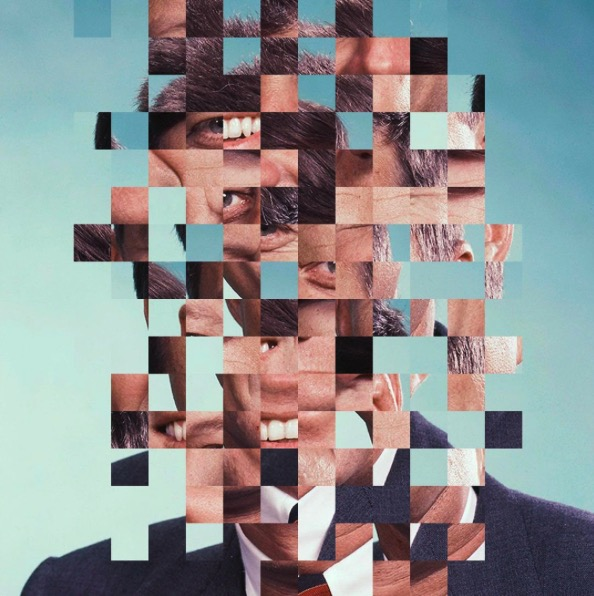
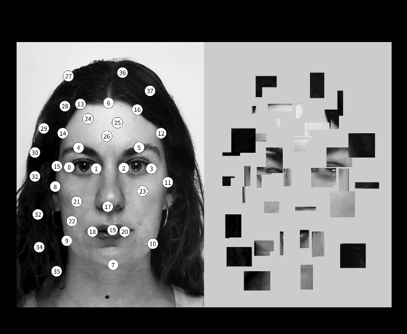
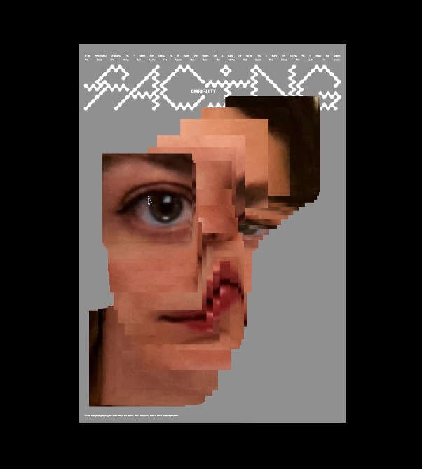
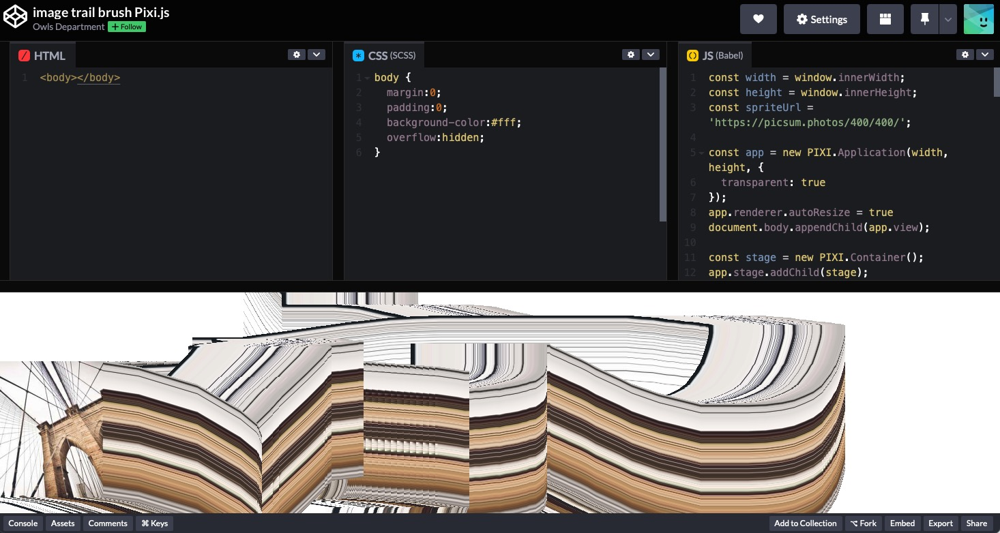

# hxie0045_9103_tut4
#### Part 1: Imaging Technique Inspiration

I searched two similar artworks which inspired me a lot. The first artwork is a static deconstructed image, designed by a German design studio Schultzschultzgrafik, using the software Processing. 

You can see that the image is cut into many segments and arranged randomly, creating a glitch-like effect. It's similar to the Mona Lisa artwork we studied in Week 7, but more intriguing. This piece introduces a fresh and mysterious visual experience.


[reference link](https://www.instagram.com/p/CGZ6X8shvqn/?igshid=i49e08v8iso6)

The second interactive artwork is a creative coding exploration called *Nemberial Realities*, designed by Lana Weber, a creative coder. This piece features two different interaction methods, both allowing the user to interact with the image using the mouse. 

The first method lets you click on the image to select segments, which are then displayed on a separate canvas to form a new composition.


[reference link](https://lenaweber.com/archives/357)

In the second method, the image follows the mouse trail, creating a tailing effect. This results in a new image that appears slightly freaky and distorted. I really appreciate this concept because it allows you to modify the portrait based on your own understanding and interpretation, effectively expressing your perspective in a visual form.


[reference link](https://lenaweber.com/archives/357)

#### Part 2: Coding Technique Exploration

Based on the inspiration above, I found an open-source code on Codepen. A user called Owls Department shared the code, which can achieve the similar image trail effect seen in the second artwork.


[reference link](https://codepen.io/owls/pen/vvbxYQ)

Full JS code
```
const width = window.innerWidth; //set up the width and height of the canvas
const height = window.innerHeight;
const spriteUrl = 'https://picsum.photos/400/400/'; //provide image randomly, but we don't need that

const app = new PIXI.Application(width, height, { 
  transparent: true
});
app.renderer.autoResize = true
document.body.appendChild(app.view);

//create the stage and brush (Sprite)
const stage = new PIXI.Container(); //PIXI.Container is used to store all objects that need to be rendered (similar to the stage).
app.stage.addChild(stage);

const trail = [];
const limit = 5000;
const maxDensity = 100;

let texture = PIXI.Texture.fromImage(spriteUrl); //Loads a texture from the specified image URL.
let brush = new PIXI.Sprite(texture); //Package the texture into a Sprite object for easy subsequent operations.
let previousPosition;

//set up the initial position of the brush
brush.position.x = 250;
brush.position.y = 250;
brush.width = 200
brush.height = 200
brush.anchor.set(0.5, 0.5)

stage.addChild(brush);

//Mousemove event
app.stage.interactive = true
app.stage.on('pointermove', (e) => {
  moveTo(e.data.global);
});

//Logic for handling mouse movement
function moveTo(position) {
  drawIntermediate(previousPosition, position);

  brush.position.copy(position);
  
  previousPosition = position.clone();
}

//Drawing the "trail"
function paintBrush(position) {
  let copy = new PIXI.Sprite(texture);
  copy.position.copy(position);
  copy.width = 200
  copy.height = 200
  copy.anchor.set(0.5, 0.5)
  stage.addChild(copy);
  
  trail.push(copy);
  
  if (trail.length > limit) {
    let trash = trail.shift();
    stage.removeChild(trash);
    trash.destroy();
  }
}

function drawIntermediate(prev, curr) {
  if (prev) {
    let density = calculateInterpolationDensity(prev, curr);
    for (let i=0; i<=density; i++) {
      paintBrush(interpolate(prev, curr, i/density));
    }
  } else {
    paintBrush(curr);  
  }
}

function calculateInterpolationDensity(prev, curr) {
  let dx = Math.abs(prev.x - curr.x);
  let dy = Math.abs(prev.y - curr.y);
  
  return Math.round(
    Math.min(
      Math.max(dx, dy),
      maxDensity
    )
  );
}

function interpolate(a, b, frac) {
    var nx = a.x+(b.x-a.x)*frac;
    var ny = a.y+(b.y-a.y)*frac;
    return new PIXI.Point(nx, ny);
}

window.addEventListener('resize', () => {
	const parent = app.view.parentNode;
	app.renderer.resize(parent.clientWidth, parent.clientHeight);
});
```

This code uses PIXI.js for rendering, and generates a trail of images on the canvas through the movement of the mouse, similar to the "brush" effect. Specifically, when you move the mouse, the image will follow the mouse track, and multiple image instances will be generated to form a gradual track effect. This code is suitable for some real-time interactive visual effects, such as dynamic image smear, glitch art effects, etc.


